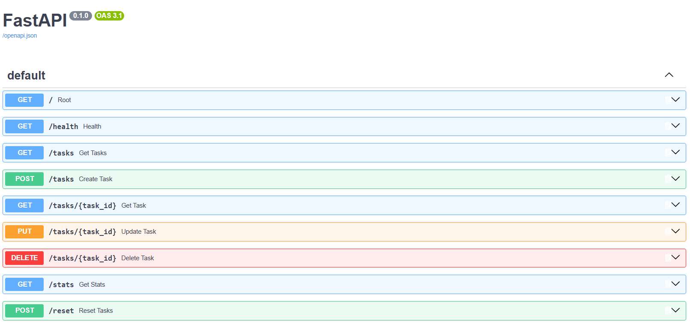

# Task API

A small CRUD API built with Python and FastAPI as part of the FlyRank Backend Engineering + AI Internship.

The API manages a simple in-memory to-do list and supports creating, reading, updating, deleting, filtering, searching, and analyzing tasks.

## Features

- Create tasks
- List all tasks
- Get a single task
- Update tasks
- Delete tasks
- Input validation
- HTTP status codes
- Query parameter filtering
- Task search
- Task statistics
- Reset task data
- Interactive Swagger UI documentation

## Requirements

- Python 3.10+
- FastAPI
- Uvicorn

## Installation

Clone the repository and enter the project directory:

```bash
git clone https://github.com/mShahanJaved/task-api.git
cd task-api
```

Create and activate a virtual environment:

### Windows PowerShell

```powershell
python -m venv .venv
.venv\Scripts\Activate.ps1
```

Install the dependencies:

```powershell
pip install -r requirements.txt
```

## Run the API

Start the development server:

```powershell
fastapi dev main.py
```

The API will be available at:

```text
http://localhost:8000
```

## Swagger UI

Interactive API documentation is available at:

```text
http://localhost:8000/docs
```

Swagger UI can be used to test the complete CRUD cycle and optional features without using curl.



## API Endpoints

| Method | Endpoint | Description | Success |
|---|---|---|---|
| GET | `/` | Returns API information | 200 |
| GET | `/health` | Checks API health | 200 |
| GET | `/tasks` | Returns all tasks | 200 |
| GET | `/tasks/{task_id}` | Returns a task by ID | 200 |
| POST | `/tasks` | Creates a new task | 201 |
| PUT | `/tasks/{task_id}` | Updates an existing task | 200 |
| DELETE | `/tasks/{task_id}` | Deletes a task | 204 |
| GET | `/stats` | Returns task statistics | 200 |
| POST | `/reset` | Resets tasks to the original seed data | 200 |

## Query Parameters

The `/tasks` endpoint supports optional query parameters.

### Filter by completion status

```text
GET /tasks?done=true
```

Returns only completed tasks.

```text
GET /tasks?done=false
```

Returns only incomplete tasks.

### Search tasks

```text
GET /tasks?search=milk
```

Returns tasks whose titles contain `milk`.

Filtering and search can also be combined:

```text
GET /tasks?done=false&search=milk
```

## Statistics

The `/stats` endpoint calculates task statistics:

```text
GET /stats
```

Example response:

```json
{
  "total": 3,
  "done": 1,
  "open": 2
}
```

## Reset

The `/reset` endpoint restores the original three example tasks:

```text
POST /reset
```

This is useful for testing and demonstrations.

## Example

Health check using curl:

```powershell
curl.exe -i http://localhost:8000/health
```

Output:

```text
HTTP/1.1 200 OK
date: Fri, 28 Aug 2026 06:16:41 GMT
server: uvicorn
content-length: 15
content-type: application/json

{"status":"ok"}
```

## Validation

The API validates incoming data.

For example, sending an empty request body when creating a task:

```json
{}
```

returns:

```text
400 Bad Request
```

Unknown task IDs return:

```text
404 Not Found
```

Successful deletion returns:

```text
204 No Content
```

## Data Storage

Tasks are stored in an in-memory Python list.

This means data is lost whenever the server restarts. Restarting the server restores the original three example tasks because no persistent database is being used.

This behavior demonstrates why persistent database storage is important for real applications.

## Project Structure

```text
task-api/
├── .gitignore
├── main.py
├── requirements.txt
├── README.md
└── swagger.png
```

## Built With

- Python
- FastAPI
- Pydantic
- Uvicorn
- Swagger UI / OpenAPI
- Git & GitHub