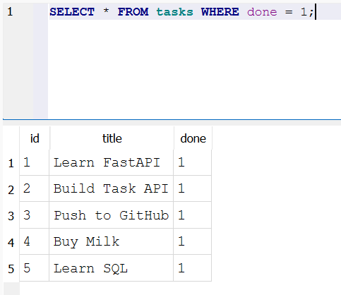

# Task API

A small CRUD API built with Python, FastAPI, and SQLite as part of the **FlyRank Backend Engineering + AI Internship — Backend Track**.

The project started as an in-memory task API in Assignment 1 and was upgraded in Assignment 2 to use a persistent **SQLite database**.

The API supports creating, reading, updating, deleting, filtering, searching, and analyzing tasks. Task data is stored in `tasks.db`, allowing it to survive server restarts.

---

## Features

- Create tasks
- List all tasks
- Get a single task by ID
- Update tasks
- Delete tasks
- Input validation
- HTTP status codes
- Query parameter filtering
- Task search
- Task statistics
- Reset task data
- Persistent SQLite database storage
- Parameterized SQL queries
- Automatic database and table creation
- Automatic seed data
- Database-backed CRUD operations
- Interactive Swagger UI documentation
- SQL exploration using DB Browser for SQLite

---

## Tech Stack

- Python 3.10+
- FastAPI
- Uvicorn
- Pydantic
- SQLite
- Python `sqlite3` standard library
- Swagger UI / OpenAPI
- DB Browser for SQLite
- Git
- GitHub

---

## Requirements

Before running the project, make sure you have:

- Python 3.10 or newer
- Git
- A web browser

SQLite does not require a separate database server when using Python's built-in `sqlite3` module.

The SQLite database file is created automatically by the application.

---

## Installation

### 1. Clone the repository

```bash
git clone https://github.com/mShahanJaved/task-api.git
cd task-api
```

### 2. Create a virtual environment

**Windows PowerShell**

```powershell
python -m venv .venv
```

Activate the virtual environment:

```powershell
.venv\Scripts\Activate.ps1
```

### 3. Install dependencies

```powershell
pip install -r requirements.txt
```

---

## Run the API

Start the development server:

```powershell
fastapi dev main.py
```

The API will be available at:

```text
http://localhost:8000
```

### Swagger UI

Interactive API documentation is available at:

```text
http://localhost:8000/docs
```

Swagger UI can be used to test the API endpoints directly from the browser.


---

## Database

The application uses SQLite for persistent data storage.

The database file is:

```text
tasks.db
```

It is created automatically when the application starts if it does not already exist.

The database contains a `tasks` table with the following columns:

| Column | Type | Description |
|--------|------|-------------|
| `id` | INTEGER | Primary key automatically assigned by SQLite |
| `title` | TEXT | Task title |
| `done` | INTEGER | Completion status (`0 = false`, `1 = true`) |

### Database Initialization

When the application starts, it:

1. Opens or creates `tasks.db`.
2. Creates the `tasks` table if it does not already exist.
3. Checks whether the table contains any tasks.
4. Inserts the example tasks only when the table is empty.
5. Commits the changes.

This prevents the seed tasks from being duplicated every time the server restarts.

---

## Persistent Storage

In Assignment 1, tasks were stored in a Python list:

```text
Client
   ↓
FastAPI
   ↓
Python list
```

Data was lost whenever the server restarted.

In Assignment 2, the storage layer was replaced with SQLite:

```text
Client
   ↓
FastAPI
   ↓
SQLite
   ↓
tasks.db
```

The API now reads and writes task data directly to the SQLite database.

Because the data is stored in `tasks.db`, tasks survive server restarts.

---

## API Endpoints

| Method | Endpoint | Description | Success |
|--------|----------|-------------|---------|
| GET | `/` | Returns API information | 200 |
| GET | `/health` | Checks API health | 200 |
| GET | `/tasks` | Returns tasks | 200 |
| GET | `/tasks/{task_id}` | Returns a task by ID | 200 |
| POST | `/tasks` | Creates a new task | 201 |
| PUT | `/tasks/{task_id}` | Updates an existing task | 200 |
| DELETE | `/tasks/{task_id}` | Deletes a task | 204 |
| GET | `/stats` | Returns task statistics | 200 |
| POST | `/reset` | Resets tasks to the original seed data | 200 |

---

## Query Parameters

The `/tasks` endpoint supports optional filtering and searching.

### Filter by completion status

Get completed tasks:

```text
GET /tasks?done=true
```

Get incomplete tasks:

```text
GET /tasks?done=false
```

### Search tasks

Search by title:

```text
GET /tasks?search=milk
```

The search returns tasks whose titles contain the search text.

### Combine filtering and search

```text
GET /tasks?done=false&search=milk
```

This returns incomplete tasks whose titles contain `milk`.

---

## CRUD Operations

### Create a Task

**Request**

```text
POST /tasks
```

Example request body:

```json
{
  "title": "Buy milk"
}
```

The database automatically generates the task ID.

Example response:

```json
{
  "id": 4,
  "title": "Buy milk",
  "done": false
}
```

Status code:

```text
201 Created
```

The task is stored in `tasks.db` and remains available after a server restart.

---

### Get All Tasks

**Request**

```text
GET /tasks
```

Example response:

```json
[
  {
    "id": 1,
    "title": "Learn FastAPI",
    "done": false
  },
  {
    "id": 2,
    "title": "Build Task API",
    "done": false
  },
  {
    "id": 3,
    "title": "Push to GitHub",
    "done": false
  }
]
```

---

### Get a Single Task

**Request**

```text
GET /tasks/1
```

Example response:

```json
{
  "id": 1,
  "title": "Learn FastAPI",
  "done": false
}
```

If the task does not exist:

```text
404 Not Found
```

---

### Update a Task

**Request**

```text
PUT /tasks/1
```

Example request body:

```json
{
  "title": "Learn FastAPI properly",
  "done": true
}
```

Example response:

```json
{
  "id": 1,
  "title": "Learn FastAPI properly",
  "done": true
}
```

Status code:

```text
200 OK
```

The update is written directly to the SQLite database.

If the task does not exist:

```text
404 Not Found
```

Invalid request data returns:

```text
400 Bad Request
```

---

### Delete a Task

**Request**

```text
DELETE /tasks/1
```

Successful deletion returns:

```text
204 No Content
```

The response body is empty.

If the task does not exist:

```text
404 Not Found
```

---

## SQL and Parameterized Queries

The API uses SQL queries to communicate with SQLite.

### Retrieve a task

```sql
SELECT * FROM tasks WHERE id = ?
```

The task ID is passed separately as a parameter instead of being directly inserted into the SQL string.

This is called a **parameterized query** and is a standard technique for reducing SQL injection risks.

### Create a task

```sql
INSERT INTO tasks (title, done)
VALUES (?, ?)
```

### Update a task

```sql
UPDATE tasks
SET title = ?, done = ?
WHERE id = ?
```

### Delete a task

```sql
DELETE FROM tasks
WHERE id = ?
```

---

## SQL Exploration

The database can also be inspected directly using **DB Browser for SQLite**.

The database file is:

```text
tasks.db
```

DB Browser can be used to:

- View the `tasks` table
- Inspect task rows
- Execute SQL queries
- Modify database records
- Verify that API changes are stored in SQLite



### Example SQL Queries

List all tasks:

```sql
SELECT * FROM tasks;
```

Get completed tasks:

```sql
SELECT * FROM tasks
WHERE done = 1;
```

Count all tasks:

```sql
SELECT COUNT(*) FROM tasks;
```

Mark every task as completed:

```sql
UPDATE tasks
SET done = 1;
```

Delete all completed tasks:

```sql
DELETE FROM tasks
WHERE done = 1;
```

Changes made directly in DB Browser are reflected by the API because both the API and DB Browser use the same `tasks.db` file.

---

## Statistics

The `/stats` endpoint returns task statistics.

**Request**

```text
GET /stats
```

Example response:

```json
{
  "total": 3,
  "done": 1,
  "open": 2
}
```

Where:

- `total` = total number of tasks
- `done` = number of completed tasks
- `open` = number of incomplete tasks

---

## Reset

The `/reset` endpoint restores the original example tasks.

**Request**

```text
POST /reset
```

This endpoint is useful for testing and demonstrations.

---

## Validation

The API validates incoming request data using Pydantic.

Creating a task requires a non-empty title.

Invalid request:

```json
{}
```

or:

```json
{
  "title": ""
}
```

returns:

```text
400 Bad Request
```

Unknown task IDs return:

```text
404 Not Found
```

Successful deletion returns:

```text
204 No Content
```

---

## Example: Health Check

Using curl:

```powershell
curl.exe -i http://localhost:8000/health
```

Example response:

```text
HTTP/1.1 200 OK
content-type: application/json

{"status":"ok"}
```

---

## Persistence Test

One of the main goals of Assignment 2 is proving that task data survives a server restart.

1. Start the API.
2. Create a task using `POST /tasks`.
3. Run `GET /tasks`.
4. Stop the server.
5. Start the server again.
6. Run `GET /tasks`.

The task created before the restart should still exist.

This demonstrates that the API is reading and writing persistent data from `tasks.db` instead of an in-memory Python list.

---

## Project Structure

```text
task-api/
├── .gitignore
├── main.py
├── requirements.txt
├── README.md
├── swagger.png
├── query.png
└── tasks.db
```

### Files

- **`main.py`** — Contains the FastAPI application, API routes, validation, and SQLite database operations.
- **`tasks.db`** — SQLite database containing persistent task data.
- **`requirements.txt`** — Contains the Python dependencies required to run the project.
- **`README.md`** — Project documentation and setup instructions.
- **`swagger.png`** — Screenshot demonstrating the API through Swagger UI.
- **`query.png`** — Screenshot demonstrating SQL queries executed against the SQLite database using DB Browser for SQLite.
- **`.gitignore`** — Prevents files such as the Python virtual environment and Python cache files from being committed.

---

## HTTP Status Codes

| Status | Meaning |
|--------|---------|
| 200 | Successful request |
| 201 | Resource successfully created |
| 204 | Resource successfully deleted |
| 400 | Invalid request |
| 404 | Task not found |
| 500 | Internal server error |

---

## Learning Outcomes

This project demonstrates practical backend concepts including:

- REST API development
- CRUD operations
- FastAPI routing
- Pydantic validation
- HTTP status codes
- Query parameters
- SQLite databases
- SQL queries
- Persistent data storage
- Primary keys
- Auto-generated database IDs
- Parameterized queries
- Database-backed API design
- Database inspection with DB Browser for SQLite
- API testing with Swagger UI
- Git version control
- GitHub repository management

---

## Assignment Progress

This project is part of the **FlyRank Backend Engineering + AI Internship — Backend Track**.

### Assignment 1 — Build Your First CRUD API

Completed:

- FastAPI application
- CRUD endpoints
- Request validation
- Query parameters
- Search
- Statistics
- Reset functionality
- Swagger UI
- GitHub publication

### Assignment 2 — Connect CRUD to the Database

Completed stages:

- **Stage 0 — Create SQLite database**
- **Stage 1 — Read from database**
- **Stage 2 — Insert new tasks into database**
- **Stage 3 — Update and delete tasks using SQL**
- **Stage 4 — Explore SQLite using DB Browser for SQLite**

The application now uses SQLite as its persistent storage layer.

---

## Architecture

```text
Client
   │
   │ HTTP Requests
   ▼
FastAPI
   │
   │ SQL Queries
   ▼
SQLite
   │
   ▼
tasks.db
```

The client communicates with the API.

The API handles routing, validation, and application logic while communicating with SQLite for persistent data storage.

---

## Built With

- Python
- FastAPI
- Pydantic
- Uvicorn
- SQLite
- Python `sqlite3`
- Swagger UI / OpenAPI
- DB Browser for SQLite
- Git
- GitHub

---

## Author

**Shahan Javed**

Built as part of the **FlyRank Backend Engineering + AI Internship**.

GitHub Repository:

https://github.com/mShahanJaved/task-api